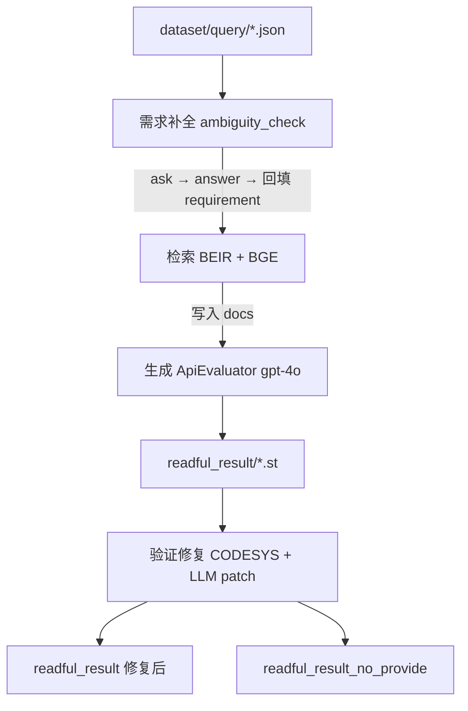

# RepoSTGen 项目使用说明书（工作交接版）

| 项目 | 说明 |
|------|------|
| 版本 | 2026-06-16 |
| 适用对象 | 接手 RepoSTGen 项目的研发/评测人员 |
| 项目仓库 | [https://github.com/t78bb/RepoSTGen.git](https://github.com/t78bb/RepoSTGen.git) |

---

## 一、项目简介

RepoSTGen 是一个面向 IEC 61131-3 Structured Text（ST）代码的「需求 → 检索 → 生成 → 验证修复 → 评测」全流程系统，主要面向 RepoEval 风格的 PLC 代码补全/生成任务。

**核心能力：**

1. **需求补全**：识别需求模糊点，自动追问并回填澄清内容
2. **代码库检索**：基于 BEIR + Sentence-BERT 检索相关代码片段
3. **LLM 代码生成**：调用大模型 API 生成 ST 代码
4. **CODESYS 验证修复**：调用 CODESYS 编译服务检查语法，并用 LLM 自动修复
5. **多维度评测**：CodeBLEU（结构相似度）、LITL（LLM 评判）、语法检查通过率等

---

## 二、环境准备

### 2.1 基础环境

- **操作系统**：Windows（当前开发与 CODESYS 联调主要在 Windows）
- **Python**：建议 3.10+（项目曾在 Python 3.14 环境记录过依赖）
- **Git**：用于拉取/推送代码

### 2.2 Python 依赖（按需安装）

在项目根目录执行：

```bash
pip install openai tiktoken accelerate transformers datasets torch
pip install "tree-sitter>=0.22.0,<0.24.0" "tree-sitter-python~=0.21"
pip install beir rapidfuzz
```

LITL 模块单独依赖（见 `LITL/requirements.txt`）：

```bash
pip install openai>=1.0.0
```

### 2.3 大模型 API 配置（必须）

全流程、需求补全、代码生成、验证修复、LITL 评测均依赖 LLM API。当前默认使用「智增增」中转站，在 CMD 中设置环境变量：

```cmd
set ZHIZENGZENG_API_KEY=你的API密钥
set ZHIZENGZENG_BASE_URL=https://api.zhizengzeng.com/v1
```

也可使用通用变量（部分脚本会回退读取）：

```cmd
set OPENAI_API_KEY=你的API密钥
set BASE_URL=https://api.zhizengzeng.com/v1
```

LITL 评测可在 `LITL/config.py` 中修改默认模型（默认 `gpt-5.2`），或通过命令行 `--model` 覆盖。

### 2.4 CODESYS 编译服务（验证/修复步骤需要）

验证修复（`verifier`）和批量语法检查依赖远程 CODESYS API。

环境变量（按实际部署修改）：

```cmd
set CODESYS_API_URL=http://192.168.x.x:9000/api/v1/pou/new_project_workflow
```

本地需有对应的 CODESYS 工程目录（`.project` 文件），默认路径在代码中硬编码为：

```
F:\codesys_call\CODESYSCompileService-main\projects
```

每个评测项目名 `repoeval_xxx` 会映射到 `projects` 下的 `xxx` 工程。若路径不同，运行 `batch_syntax_check_output.py` 时用 `--projects-root` 指定。

### 2.5 网络代理（国内访问 GitHub 时）

若 `git push/pull` 失败（`Connection was reset`），需为 Git 配置本地代理，例如：

```cmd
git config --global http.proxy http://127.0.0.1:7890
git config --global https.proxy http://127.0.0.1:7890
```

---

## 三、目录结构说明

项目根目录（`repoSTGen/`）主要子目录：

```
repoSTGen/
├── full_process.py              # 【主入口】完整流程脚本
├── evaluate_output.py           # 【评测入口】批量 CodeBLEU 评测
├── batch_syntax_check_output.py # 【评测入口】批量 CODESYS 语法检查
├── batch_create_no_provide.py   # 批量生成 readful_result_no_provide
│
├── dataset/
│   ├── query/                           # 输入需求（每项目一子目录，每 case 一 .json）
│   ├── project_code/                    # 完整参考代码（LITL ground truth）
│   ├── generation_context_ground_truth/ # 实现逻辑参考（CodeBLEU 默认对照）
│   └── BEIR_data/                       # 检索语料（体积较大）
│
├── output/                      # 实验输出（按时间戳分子目录，已在 .gitignore）
│   └── YYYYMMDD_HHMMSS/
│       └── repoeval_xxx/
│           ├── results.jsonl
│           ├── readful_result/
│           ├── readful_result_no_provide/
│           ├── readful_result_before_fix/
│           ├── ask/、answers/
│           └── plan_results/、plan_prompts/
│
├── generator/                   # LLM 代码生成
├── retrieve/                    # BEIR 检索
├── verifier/                    # CODESYS 验证与 LLM 修复
├── requirement_completion/      # 需求模糊点识别与追问
├── planner/                     # 可选：生成前规划
├── LITL/                        # LLM-in-the-Loop 评测
├── evaluate/                    # CodeBLEU 评估器
└── codebleu-main/               # CodeBLEU 实现
```

### query JSON 文件格式示例

`dataset/query/repoeval_counter/FB_counter.json`：

```json
{
  "requirement": "任务需求描述（英文）",
  "provide_code": "已提供的变量声明等上下文（ST 代码）",
  "function_name": "FB_counter"
}
```

---

## 四、全流程使用（推荐主流程）

### 4.1 标准全流程

从 `dataset/query` 读取所有项目，依次执行：

| 步骤 | 内容 |
|------|------|
| 0 | 从 query 生成 `results.jsonl` |
| 1 | 需求补全（`ambiguity_check` + 自动回答 + 回填 requirement） |
| 2 | 检索（BEIR，将相关代码片段写入 `results.jsonl` 的 `docs` 字段） |
| 3 | 代码生成（LLM API → `readful_result/*.st`） |
| 4 | 验证修复（CODESYS 编译检查 + LLM 补丁修复，原地修改 `readful_result`），并自动生成 `readful_result_no_provide` |

**命令（在项目根目录 CMD 中）：**

```cmd
cd /d e:\毕业论文\repoSTGen\repoSTGen
set ZHIZENGZENG_API_KEY=你的密钥
set ZHIZENGZENG_BASE_URL=https://api.zhizengzeng.com/v1
set CODESYS_API_URL=http://你的CODESYS服务地址/api/v1/pou/new_project_workflow

python full_process.py
```

**运行结束后：**

- 结果保存在：`output/YYYYMMDD_HHMMSS/`
- 汇总文件：`output/YYYYMMDD_HHMMSS/full_process_results_YYYYMMDD_HHMMSS.json`

> **注意**：当前 `full_process.py` **不自动执行 CodeBLEU**，需单独运行评测（见第五节）。

### 4.2 常用参数

```cmd
# 只跑指定项目（可多个）
python full_process.py --project repoeval_counter repoeval_traffic_light

# 只跑某个 case（按 JSON 文件名，不含扩展名）
python full_process.py --project repoeval_counter --case FB_counter

# 跳过检索（消融：需求补全 → 直接生成）
python full_process.py --skip_retrieve

# 跳过需求补全的回答步骤（只 ask 不 answer，不回填）
python full_process.py --skip_answer

# 跳过规划步骤
python full_process.py --skip_plan

# 只生成，不修复
python full_process.py --skip_fix

# 只修复，不生成（需已有 output 结果）
python full_process.py --result_dir 20260306_120000 --skip_generation

# 从已有 output 子目录继续（生成 + 修复）
python full_process.py --result_dir 20260306_120000

# 启用经验库自增长
python full_process.py --enable-self-growing-kb
```

### 4.3 单步模块（高级 / Debug）

| 步骤 | 命令 / 说明 |
|------|-------------|
| 仅检索 | 由 `full_process` 内部调用 `retrieve/eval_beir_sbert_canonical.py` |
| 仅批量生成 | `python generator/batch_generation.py --result_dir 20260306_120000` |
| 仅需求补全 | `python requirement_completion/ambiguity_check.py --project repoeval_counter --run-id 20260306_120000 --auto-answer` |
| 仅验证修复 | `full_process.run_fix` 已封装 `verifier/auto_fix_st_code.py` 逻辑 |

### 4.4 流程示意图



---

## 五、评测流程

全流程跑完后，通常需要三类评测：**CodeBLEU**、**LITL**、**语法检查**。

### 5.1 CodeBLEU 评测（结构/逻辑相似度）

**脚本**：`evaluate_output.py`

#### 两种评测模式

| 模式 | 生成代码 | 参考代码 | 说明 |
|------|----------|----------|------|
| **A - 实现逻辑（默认，推荐）** | `readful_result_no_provide/*.st` | `dataset/generation_context_ground_truth/<项目名>/*.st` | 去掉 `provide_code`，只比较补全的实现部分 |
| **B - 完整代码** | `readful_result/*.st` | `dataset/project_code/<项目名>/FUN/*.st` | 比较完整 POU 与标准答案 |

#### 命令

```cmd
# 模式 A（默认）
python evaluate_output.py --dir output/20260306_120000

# 模式 B
python evaluate_output.py --dir output/20260306_120000 --use_project_code_gt

# 指定语言解析器（ST 无原生支持，默认用 python 近似，实测能较好反映匹配程度）
python evaluate_output.py --dir output/20260306_120000 --lang python
```

#### 输出

- 每个项目目录下：`codebleu_evaluation.json`
- 批次根目录下：`evaluation_summary_YYYYMMDD_HHMMSS.json`（含 `overall_statistics.average_scores` 和 `project_statistics`）

#### 指标说明

| 指标 | 含义 |
|------|------|
| `codebleu` | 综合分（默认四项各 1/4 加权） |
| `ngram_match_score` | 词法 N-gram 匹配 |
| `weighted_ngram_match_score` | 加权 N-gram |
| `syntax_match_score` | 语法树匹配 |
| `dataflow_match_score` | 数据流匹配 |

**单项目评测：**

```cmd
python evaluate/codebleu_evaluator.py "output/20260306_120000/repoeval_counter"
```

**对比两次评测结果：** 修改 `compare_evaluation_summaries.py` 中的 `SECOND_PATH`，然后：

```cmd
python compare_evaluation_summaries.py
```

---

### 5.2 LITL 评测（LLM-in-the-Loop）

**脚本**：`LITL/litl_evaluator.py`

使用独立「验证器 LLM」从四个维度打分：

| 维度 | 权重 |
|------|------|
| 功能正确性 | 40% |
| 可读性和风格 | 20% |
| 安全合规性 | 25% |
| 模块化 | 15% |

通过阈值：总分 ≥ 60（可在 `LITL/config.py` 修改 `PASS_THRESHOLD`）

#### 输入要求

- 生成代码：`output/<dir>/repoeval_xxx/readful_result/*.st`
- 参考代码：`dataset/project_code/<项目名>/FUN/*.st`
- 需求文件：`dataset/query/repoeval_xxx/<case>.json`

#### 命令

```cmd
cd LITL
set OPENAI_API_KEY=你的密钥

python litl_evaluator.py --dir 20260306_120000
python litl_evaluator.py --dir 20260306_120000 --model gpt-4-turbo
python litl_evaluator.py --dir 20260306_120000 --output litl_result.json
```

#### 输出与后处理

- 输出：`litl_evaluation_<timestamp>.json`
- 提取通过率：`python LITL/evaluate_case_rate.py output/20260306_120000/litl_evaluation_xxx.json`
- 多实验合并最优：`python LITL/merge_litl_best.py run1.json run2.json run3.json -k 0 -o merge_best`

---

### 5.3 CODESYS 语法检查（编译通过率）

**脚本**：`batch_syntax_check_output.py`（仅检查，不修复）

```cmd
python batch_syntax_check_output.py 20260306_120000

python batch_syntax_check_output.py 20260306_120000 ^
  --ip-port http://192.168.x.x:9000/api/v1/pou/new_project_workflow ^
  --projects-root F:\codesys_call\CODESYSCompileService-main\projects
```

**输出**：`output/20260306_120000/syntax_check_report_YYYYMMDD_HHMMSS.json`

---

### 5.4 推荐评测顺序

1. 跑完全流程 → 确认 `output/<run_id>/` 下各项目有 `readful_result`
2. CodeBLEU：`python evaluate_output.py --dir output/<run_id>`
3. 语法检查：`python batch_syntax_check_output.py <run_id>`
4. LITL（耗时/API 费用较高）：`python LITL/litl_evaluator.py --dir <run_id>`
5. 汇总对比：`compare_evaluation_summaries.py` / `evaluate_case_rate.py`

---

## 六、典型使用场景示例

### 场景 1：新人首次复现完整实验

1. 克隆仓库，配置 API 与 CODESYS 环境变量
2. 确认 `dataset/query`、`dataset/BEIR_data`、`dataset/project_code` 数据齐全
3. `python full_process.py --project repoeval_counter`（先跑小项目试通）
4. `python evaluate_output.py --dir output/<新生成的时间戳目录>`
5. `python batch_syntax_check_output.py <时间戳目录名>`

### 场景 2：消融实验 - 去掉检索

```cmd
python full_process.py --skip_retrieve --project repoeval_counter
```

### 场景 3：消融实验 - 去掉需求补全

```cmd
python full_process.py --skip_answer
```

### 场景 4：已有生成结果，只补跑修复

```cmd
python full_process.py --result_dir 20260306_120000 --skip_generation
```

### 场景 5：只评测某次历史 output

```cmd
python evaluate_output.py --dir output/20260306_120000
python LITL/litl_evaluator.py --dir 20260306_120000
```

### 场景 6：生成 readful_result_no_provide（若缺失）

修改 `batch_create_no_provide.py` 中 `TARGET_ROOT` 为目标目录，然后：

```cmd
python batch_create_no_provide.py
```

---

## 七、输出产物与字段说明

一次完整运行 `output/<run_id>/` 关键文件：

| 文件/目录 | 说明 |
|-----------|------|
| `results.jsonl` | 每行一个 case，含 requirement、docs、prompt、function_name 等 |
| `readful_result/<case>.st` | 生成并修复后的 ST 代码 |
| `readful_result_no_provide/<case>.st` | 去掉 provide_code，用于逻辑 CodeBLEU |
| `readful_result_before_fix/` | 修复前备份 |
| `ask/`、`answers/` | 需求补全中间结果 |
| `codebleu_evaluation.json` | 运行 `evaluate_output` 后产生 |
| `syntax_check_report_*.json` | 运行 `batch_syntax_check` 后产生 |
| `litl_evaluation_*.json` | 运行 LITL 后产生 |

---

## 八、配置修改指引

| 文件 | 作用 |
|------|------|
| `LITL/config.py` | LITL API、模型、评测维度权重、通过阈值 |
| `full_process.py` 顶部 | 默认 API URL、CODESYS URL |
| `verifier/auto_fix_st_code.py` | CODESYS API、修复用 LLM 配置 |
| `requirement_completion/` | 经验库路径、追问 prompt |
| `retrieve/` 内检索参数 | 默认模型 `BAAI/bge-base-en-v1.5`、topk 等 |
| `full_process` → `run_generation` | 生成模型默认 `gpt-4o`、`temperature` 0.2 |

修改生成模型：编辑 `full_process.py` 中 `run_generation` 的 `args.model`。

---

## 九、常见问题排查

| 问题 | 处理 |
|------|------|
| `fatal: unable to access github.com ... Connection was reset` | 配置 Git 代理（见 2.5 节），或开 VPN |
| `错误: 未配置API密钥` | CMD 中 `set ZHIZENGZENG_API_KEY=...` 后重试 |
| 检索失败 / `BEIR_data` 不存在 | 确认 `dataset/BEIR_data`；或准备 `output/stable_data` 回退 |
| 修复跳过 / CODESYS 连接失败 | 检查 `CODESYS_API_URL`、服务是否启动、projects 工程是否存在 |
| `evaluate_output` 找不到 `readful_result` | 确认生成成功；路径为 `output/<run>/<project>/readful_result/` |
| 缺少 `readful_result_no_provide` | 修复后应自动生成；缺失则运行 `batch_create_no_provide.py` |
| LITL 找不到 ground truth | 确认 `dataset/project_code/<项目名>/FUN/<case>.st` 存在 |
| 全流程很慢 / API 限流 | 先用 `--project` 跑单项目；LITL `CONCURRENT_EVALUATIONS` 保持为 1 |
| `node_modules` 不应上传 Git | `.gitignore` 忽略 `node_modules/`；插件需本地 `npm install` |

---

## 十、交接清单

接手的同事请逐项确认：

- [ ] 已获取 `ZHIZENGZENG_API_KEY`（或等价 OpenAI 兼容 API）
- [ ] 已获取 CODESYS 编译服务地址与 projects 工程目录访问权限
- [ ] `dataset/query`、`project_code`、`generation_context_ground_truth`、`BEIR_data` 已就位
- [ ] 能用 `--project repoeval_counter` 跑通小样本全流程
- [ ] 能独立运行 `evaluate_output.py` 与 `batch_syntax_check_output.py`
- [ ] 了解 `output/<时间戳>/` 目录含义，不把 `output/` 提交到 Git
- [ ] 了解 LITL 评测成本较高，按需运行
- [ ] 了解各消融参数：`--skip_retrieve` / `--skip_answer` / `--skip_plan` / `--skip_fix`

---

## 十一、主要脚本速查表

| 脚本 | 用途 |
|------|------|
| `full_process.py` | 主流程：需求补全 + 检索 + 生成 + 修复 |
| `evaluate_output.py` | 批量 CodeBLEU |
| `batch_syntax_check_output.py` | 批量 CODESYS 语法检查 |
| `batch_create_no_provide.py` | 生成 `readful_result_no_provide` |
| `LITL/litl_evaluator.py` | LITL LLM 评测 |
| `LITL/evaluate_case_rate.py` | 提取 LITL 通过率 |
| `LITL/merge_litl_best.py` | 多实验按 project 合并最优 |
| `compare_evaluation_summaries.py` | 对比两次 CodeBLEU 汇总 |
| `generator/batch_generation.py` | 单独批量生成 |
| `requirement_completion/ambiguity_check.py` | 单独需求补全 |
| `dataset/stat_dataset_summary.py` | 数据集统计 |

---

> 如有环境差异（IP、路径、API 供应商），请以实际部署为准修改对应配置。
